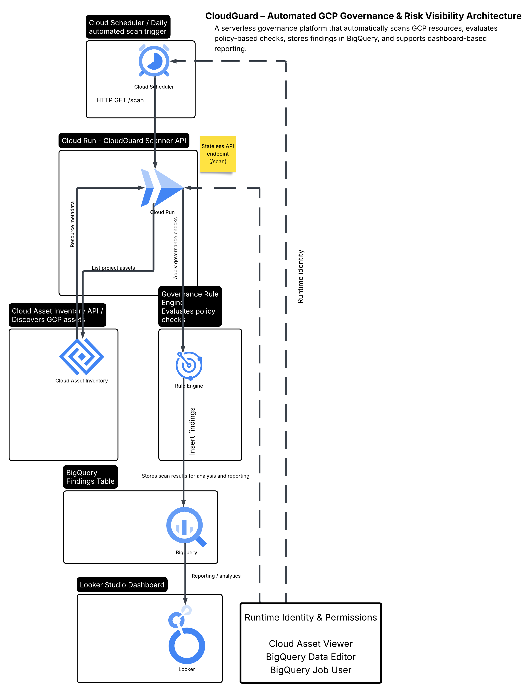
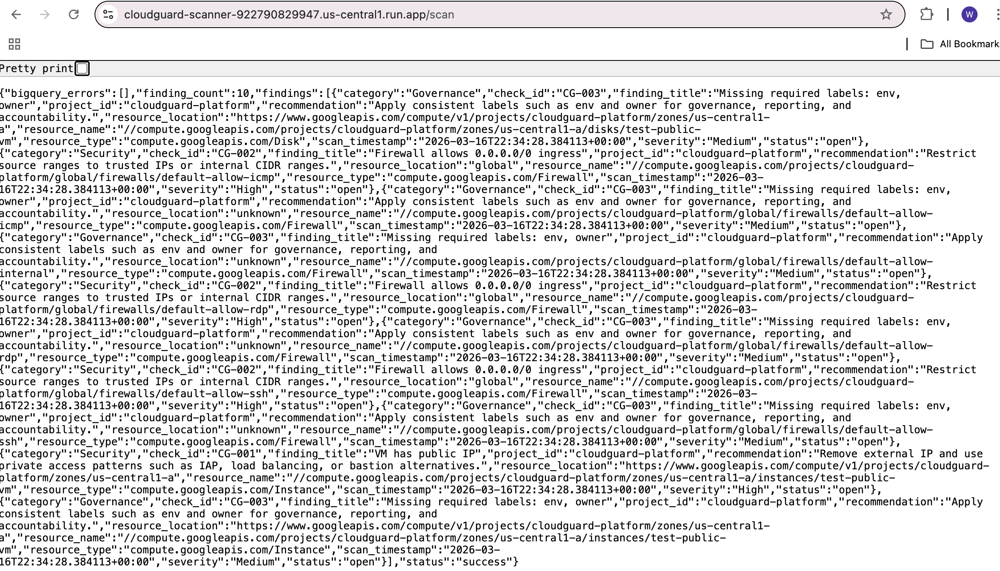
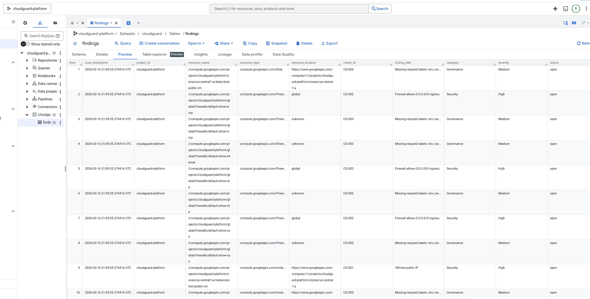
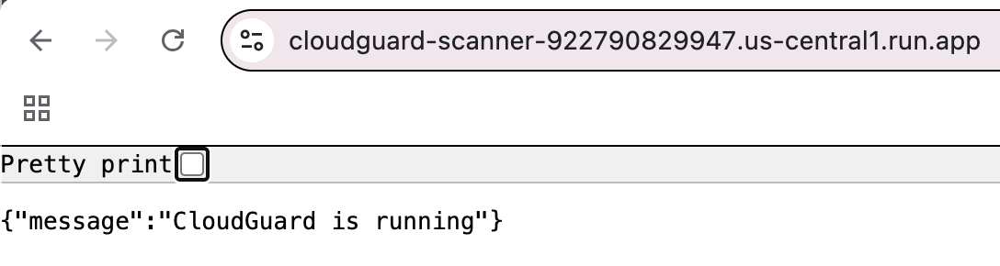
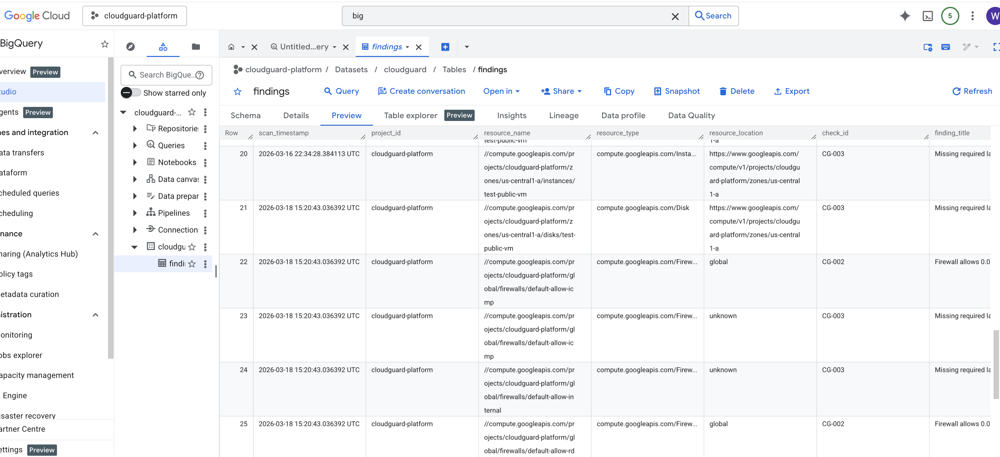
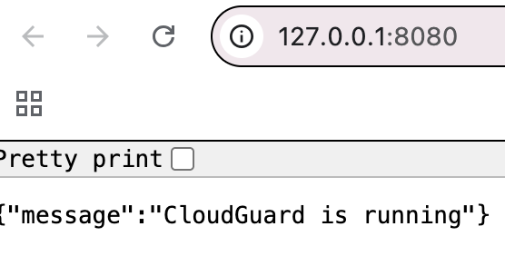
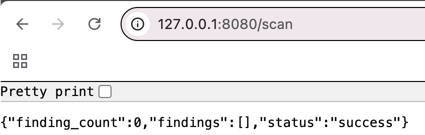

# cloudguard-gcp-governance

A GCP governance platform that scans cloud resources for security, cost, and compliance risks using Cloud Run, Cloud Asset Inventory, BigQuery, and Looker Studio.

# CloudGuard – GCP Governance & Risk Visibility Platform

## Project Question

How can organisations automatically detect cloud misconfigurations, identify cost waste, and produce actionable governance insights before those issues become security, operational, or financial problems?

## Overview

CloudGuard is a serverless governance platform built on Google Cloud. It scans cloud resources using Cloud Asset Inventory, applies lightweight governance checks, stores findings in BigQuery, and visualises issues in Looker Studio.

## Architecture

## Key Results (Live Evidence)

### Cloud Run Scan Output

### BigQuery Findings Stored

### Cloud Run Service Running

### Scheduler Triggered Scan

## Version 1 Scope

This project checks for:

- Public IP exposure on VM instances
- Overly permissive firewall rules
- Missing required labels
- Unattached persistent disks
- Severity classification of findings

## How It Works

1. Cloud Scheduler triggers a daily scan  
2. Cloud Run exposes a `/scan` API endpoint  
3. Cloud Asset Inventory retrieves all project resources  
4. A custom rule engine evaluates governance and security checks  
5. Findings are written to BigQuery  
6. Data is available for reporting in Looker Studio  

## Local Development (Proof)

## Tech Stack

- Google Cloud Platform (GCP)
  - Cloud Run
  - Cloud Scheduler
  - Cloud Asset Inventory
  - BigQuery
- Python
- Flask

## IAM & Security

The Cloud Run service uses least-privilege access:

- Cloud Asset Viewer
- BigQuery Data Editor
- BigQuery Job User

## Project Structure

cloudguard-gcp-governance/

├── app/
│   ├── main.py
│   ├── scanner.py
│   └── rules.py
│
├── docs/
│   ├── images/
│   │   └── cloudguard-architecture-diagram.png
│   └── evidence/
│       ├── cloud-run-home-working.png
│       ├── cloud-run-scan-results.png
│       ├── bigquery-findings-ingested.png
│       ├── scheduler-triggered-scan.png
│       ├── local-cloudguard-service-running.png
│       └── local-scan-success.png
│
├── requirements.txt
└── README.md

## Running Locally

pip install -r requirements.txt  
export GOOGLE_CLOUD_PROJECT=your-project-id  
gcloud auth application-default login  
python app/main.py  

Open:  
http://127.0.0.1:8080/scan  

## Future Improvements

- Add IAM and storage policy checks
- Add alerting (Slack / email)
- Build a full Looker Studio dashboard
- Support multi-project scanning
- Introduce policy-as-code

## Key Takeaways

- Built a serverless governance platform on GCP
- Automated infrastructure scanning using Cloud Asset Inventory
- Implemented policy-based rule evaluation
- Designed a data pipeline using BigQuery
- Applied IAM best practices for secure service access

